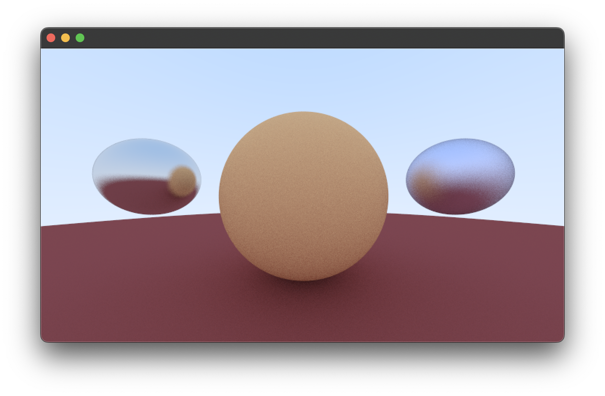

# Rust-Raytracer 

Started as a way to sink time during a 3DGraph lesson. Let's see how far I get. 

### Current Progress

### Based on these cool books/websites 

- [Ray Tracing in One Weekend](https://misterdanb.github.io/raytracinginrust/)
- [Minimal Ray Trace](https://www.scratchapixel.com/lessons/3d-basic-rendering/minimal-ray-tracer-rendering-simple-shapes/ray-sphere-intersection)